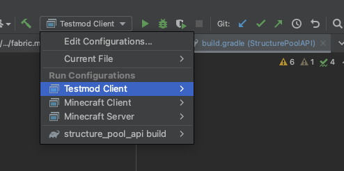

# StructurePoolAPI

Can be used to inject structures into structure pools. Popular example:
- Adding custom village structures to villages

Additional features:
- Maximize spawn count of the injected structure (e.g. 2 per village)

## Try it out

Check out this repo, resolve dependencies, select `Testmod client` run config.



Use `/locate` command to find villagers, with the example custom structures.

## Installation

Add this mod as dependency into your build.gradle file.

Repository
```groovy
repositories {
    maven {
        name = 'Modrinth'
        url = 'https://api.modrinth.com/maven'
        content {
            includeGroup 'maven.modrinth'
        }
    }
}
```

Dependency
```groovy
dependencies {
    modImplementation "maven.modrinth:structure-pool-api:${project.structure_pool_api_version}"
}
```

## Usage

To see how the API is used, check out the [example mod](src/testmod/java/net/testmod/TestMod.java).

Additionally, a config type is included in the API package, which can be read/written using JSON format. So you can expose the injection parameters as a config file for players.

## Include or depend

Feel free to include this API in your mod, the license allows you to do so.

If you want to say thank you, you can link this project as a dependency on Modrinth/CruseForge, so downloads are counted for this project too.

Mod ID: `structure_pool_api`

Modrinth dependency (gradle entry): `required.project 'structure-pool-api'`

CurseForge dependency (gradle entry): `requiredDependency 'structure-pool-api'`